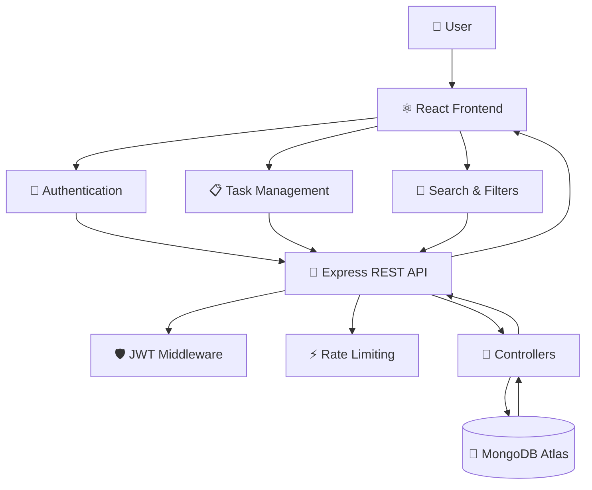

<div align="center">

# 🚀 Task Management System

### ⚡ A Modern, Secure & High-Performance MERN Task Management Platform

<p>
  
  
  
  
  
</p>

<p>
  
  
  
  
</p>

<br>


<br><br>

<a href="#-features">
  
</a>
&nbsp;
<a href="#-installation--setup">
  
</a>

</div>

---

## ✨ About The Project

**Task Management System** is a full-stack **MERN application** designed to make task organization fast, secure, and intuitive.

It combines a modern React interface with a robust Express REST API, providing:

```text
        ┌─────────────────────────────────────┐
        │       🚀 TASK MANAGEMENT SYSTEM     │
        └──────────────────┬──────────────────┘
                           │
             ┌─────────────┴─────────────┐
             │                           │
       🎨 React Frontend           ⚙️ REST API
             │                           │
       ┌─────┴─────┐             ┌───────┴──────┐
       │           │             │              │
    Optimistic   Caching       JWT Auth      MongoDB
       UI          ⚡              🔐             🍃
       │           │             │              │
       └───────────┴─────────────┴──────────────┘
                           │
                     📋 Task Management
```

> 💡 **Built for performance. Designed for simplicity. Secured for real-world usage.**

---

# 🌟 Features

## 🔐 Backend — REST API

<table>
<tr>
<td width="50%">

### 🔑 JWT Authentication

Secure authentication system with:

- User registration
- Login
- Protected routes
- JWT authorization
- Secure password handling

</td>
<td width="50%">

### 👤 Profile Management

Users can:

- Update profile information
- Upload profile avatars
- Store Base64 images
- Support payloads up to **5MB**

</td>
</tr>

<tr>
<td>

### 📋 Task CRUD

Complete task lifecycle:

- ➕ Create
- 👀 Read
- ✏️ Update
- 🗑️ Delete

</td>
<td>

### 🔎 Advanced Queries

Powerful task discovery:

- Search title
- Search description
- Filter by status
- Filter by priority
- Server-side pagination

</td>
</tr>

<tr>
<td>

### 🛡️ Security

Includes:

- bcrypt password hashing
- JWT authentication
- Protected routes
- Request validation
- Error handling

</td>
<td>

### ⚡ Performance

Backend optimizations include:

- Write-operation cooldown
- API protection
- Efficient MongoDB queries
- Pagination
- Robust middleware

</td>
</tr>
</table>

---

# 🎨 Frontend — React

<div align="center">

| Feature | Description |
|:---:|:---|
| ⚡ **Optimistic UI** | Instant interface updates before server confirmation |
| 💎 **Glassmorphism** | Modern translucent UI elements |
| 🎈 **Animations** | Floating and smooth interface animations |
| 📱 **Responsive** | Optimized for desktop, tablet & mobile |
| 🧠 **Client Cache** | 5-minute TTL cache using `useRef` |
| 🔎 **Debounced Search** | 300ms debounce to reduce API requests |
| 🧭 **React Router** | Client-side application routing |
| 🎨 **Tailwind CSS** | Utility-first responsive styling |

</div>

---

# 🧰 Tech Stack

<div align="center">

### Frontend


<br><br>

### Backend


<br><br>

### Security & Tools


</div>

---

# 🏗️ Architecture



---

# 📂 Project Structure

```text
task-management-system/
│
├── 📁 backend/
│   ├── 📁 config/
│   ├── 📁 controllers/
│   ├── 📁 middleware/
│   ├── 📁 models/
│   ├── 📁 routes/
│   ├── 📄 .env
│   ├── 📄 server.js
│   └── 📄 package.json
│
├── 📁 frontend/
│   ├── 📁 src/
│   │   ├── 📁 pages/
│   │   └── 📄 api.js
│   │   └── 📄 App.jsx
│   │   └── 📄 index.css
│   ├── 📄 .env
│   ├── 📄 index.html
│   └── 📄 package.json
│
├── 📄 README.md
└── 📄 .gitignore
```

---

# ⚙️ Installation & Setup

## 📌 Prerequisites

Make sure you have:

- 🟢 **Node.js 16+**
- 🍃 **MongoDB Atlas**
- 📦 **npm**
- 🐙 **Git**

### Download

- [Node.js](https://nodejs.org/)
- [MongoDB Atlas](https://www.mongodb.com/atlas/database)

---

## 1️⃣ Clone the Repository

```bash
git clone https://github.com/LuckyTaorem/Task-Management-System.git

cd Task-Management-System
```

---

## 2️⃣ Backend Setup

```bash
cd backend
npm install
```

Create:

```text
backend/.env
```

Add:

```env
PORT=5505

MONGO_URI=your_mongodb_connection_string

JWT_SECRET=your_super_secret_jwt_key
```

Start the backend:

```bash
npm run dev
```

Backend:

```text
http://localhost:5505
```

---

## 3️⃣ Frontend Setup

Open another terminal:

```bash
cd frontend
npm install
```

Create:

```text
frontend/.env
```

Add:

```env
VITE_API_URL=http://localhost:5505/api
```

Start the frontend:

```bash
npm run dev
```

Frontend:

```text
http://localhost:5173
```

---

# 🔌 API Documentation

All API endpoints use:

```text
/api
```

Protected endpoints require:

```http
Authorization: Bearer <JWT_TOKEN>
```

---

## 🔐 Authentication API

| Method | Endpoint | Description | Auth |
|:---:|:---|:---|:---:|
| 🟢 `POST` | `/api/auth/register` | Register a new user | ❌ |
| 🟢 `POST` | `/api/auth/login` | Authenticate user | ❌ |
| 🔵 `GET` | `/api/auth/profile` | Get user profile | ✅ |
| 🟡 `PUT` | `/api/auth/profile` | Update profile | ✅ |
| 🟡 `PUT` | `/api/auth/password` | Change password | ✅ |

---

## 📋 Task API

| Method | Endpoint | Description | Auth |
|:---:|:---|:---|:---:|
| 🟢 `POST` | `/api/tasks` | Create task | ✅ |
| 🔵 `GET` | `/api/tasks` | Get tasks | ✅ |
| 🔵 `GET` | `/api/tasks/:id` | Get specific task | ✅ |
| 🟡 `PUT` | `/api/tasks/:id` | Update task | ✅ |
| 🔴 `DELETE` | `/api/tasks/:id` | Delete task | ✅ |

---

# 🔎 Advanced Task Queries

The task endpoint supports powerful filtering and pagination.

### Available Parameters

| Parameter | Description | Example |
|:---|:---|:---|
| `search` | Search title & description | `search=report` |
| `status` | Filter by status | `status=Completed` |
| `priority` | Filter by priority | `priority=High` |
| `page` | Page number | `page=1` |
| `limit` | Results per page | `limit=10` |

### Example

```http
GET /api/tasks?status=Completed&priority=High&page=1&limit=10
```

---

## 📦 Example API Response

```json
{
  "tasks": [
    {
      "_id": "60d5ec...",
      "title": "Finalize Q3 Report",
      "description": "Compile data and finalize the Q3 executive summary.",
      "status": "Completed",
      "priority": "High",
      "dueDate": "2026-10-15T00:00:00.000Z",
      "createdAt": "2026-10-01T12:00:00.000Z"
    }
  ],
  "page": 1,
  "totalPages": 3,
  "totalTasks": 24
}
```

---

# 🧠 Performance Highlights

<div align="center">

| Optimization | Implementation |
|:---|:---|
| ⚡ Instant UI | Optimistic state updates |
| 🧠 Caching | 5-minute client-side TTL |
| 🔎 Search | 300ms debounce |
| 📄 Pagination | Server-side pagination |
| 🛡️ API Protection | Write-operation cooldown |
| 🔐 Password Security | bcrypt hashing |
| 🎯 Database | MongoDB + Mongoose |

</div>

---

# 🔒 Security

Security is treated as a first-class feature.

```text
🔐 Password
     │
     ▼
  bcrypt
     │
     ▼
🔑 JWT Token
     │
     ▼
🛡️ Protected Middleware
     │
     ▼
🚀 REST API
     │
     ▼
🍃 MongoDB
```

### Security Features

- 🔐 JWT-based authentication
- 🔒 bcrypt password hashing
- 🛡️ Protected API routes
- 🚦 Rate limiting / cooldown protection
- 🧹 Validation & error handling
- 🔑 Environment-based secrets
- 🚫 No sensitive credentials committed to Git

---

# 🤝 Contributing

Contributions are welcome! 💜

```bash
# Fork the project

# Create your feature branch
git checkout -b feature/AmazingFeature

# Commit your changes
git commit -m "Add AmazingFeature"

# Push your branch
git push origin feature/AmazingFeature

# Open a Pull Request 🚀
```

---

# ⭐ Support

If you found this project useful, consider giving it a ⭐ on GitHub.

<div align="center">

### ⭐ Star this repository if you like it!

<br>


</div>

---

# 👨‍💻 Author

<div align="center">


### **Taorem Lucky Singh**

💻 Full-Stack Developer  
🚀 MERN • Java • PHP • Web Development  
🇮🇳 India

<br>

<a href="https://github.com/LuckyTaorem">

</a>

<a href="http://luckytaorem.github.io/">

</a>

<a href="https://www.linkedin.com/in/taorem-lucky-singh">

</a>

<br><br>


</div>

---

<div align="center">

### 💜 Built with passion, caffeine & code.

**Task Management System © 2026 Taorem Lucky Singh**

</div>